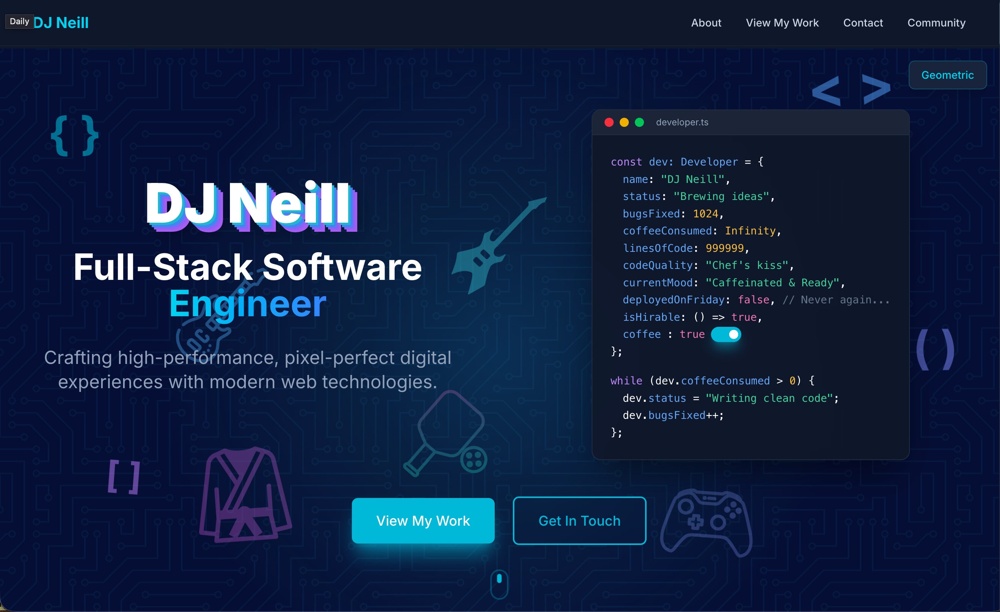

# Portfolio 2025

My personal portfolio website showcasing my work, clients, community involvement, and conference presence.

## About This Project

Built with modern web technologies to create a sleek, professional portfolio that's fast, responsive, and visually engaging. The site features a dark theme with cyan accents, smooth scroll animations, and several custom components including a CSS-only polaroid photo gallery and an infinite-scrolling client showcase.

## Tech Stack

- **React 19** - Modern UI library
- **TypeScript** - Type-safe development
- **Vite** - Lightning-fast build tool
- **Tailwind CSS 4** - Utility-first CSS framework

## Key Features

- Fully responsive design that works seamlessly across all devices
- Component-based architecture with clean separation of concerns
- Data-driven content management through TypeScript files
- Custom CSS animations and transitions
- Polaroid-style conference photo gallery
- Horizontal auto-scrolling client logo showcase
- Optimized performance and SEO
